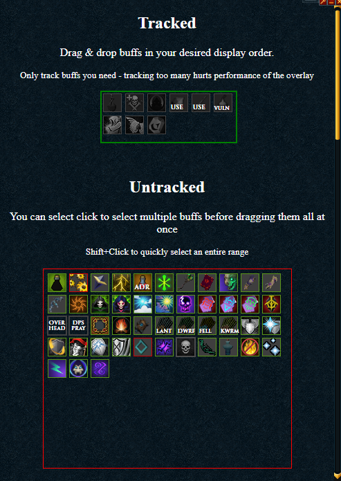
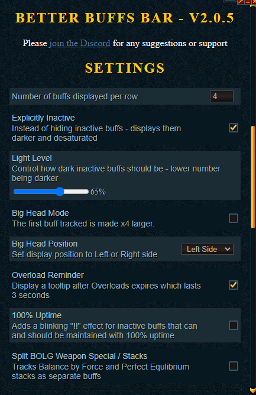

# Better Buff Bar

Track only the buffs that actually matter.

["This is what I'd like our buff bar to be." - Mod Sponge](https://youtu.be/LPV-pZ1hcAU?t=4266)

## How to Install & Required Settings

To install Better Buff Bar copy & paste this link into Alt1's browser app:
`alt1://addapp/https://nadyanayme.github.io/BetterBuffsBar/dist/appconfig.json`

If you do not have Alt1 Toolkit installed already you can [download it from runeapps.org](https://runeapps.org/alt1). In order for Better Buff Bar to work make sure your Runescape settings for buff bar size is set to `small` and that your Game and UI Scale settings are set to `100%` as these settings are required for Alt1 to be able to read your game screen.

**Currently only works with Small Buff icons**. Alt1's BuffReader only works with small buff icons so this is unlikely to change soon.

- Drag & drop buffs into desired display order (to be sorted properly the 'Fade Inactive Buffs' setting must be toggled on)
- Select number of buffs that should appear in each row
- Decide whether buffs should disappear or turn grayscale when inactive
- Set Overlay Position
- Enable Overlay

## Features

- Track important buffs (if it isn't listed it wasn't important enough - but more seriously DM me @ NadyaNayme on Discord if you'd like to add a buff to be tracked)
- Select order that buffs should be displayed and which should be tracked. Faded buffs must first be enabled to sort them.
- Choose between fading the buff out when inactive or hiding it from the better buff bar.
- "Big Head Mode" to make the first buff x4 larger
- 3s~ tooltip when Overloads expire
- Blink "!!" over maintainable buffs that have expired (eg. Overloads, Weapon Poison, Darkness, Animate Dead)

### Tracked Buffs

- Overloads & Elder Overloads (sorry Supreme Ovl. users)
- Weapon Poison
- Darkness
- Animate Dead
- Gladiator's Rage (Ful Book Proc)
- Time Rift (Jas Book Proc)
- BOLG Stacks / Spec
- FSOA Spec
- Death Guard Spec cooldown
- Omni Guard Spec cooldown
- Seren Godbow spec cooldown
- Enhanced Excalibur cooldown
- Ancient Elven Ritual Shard cooldown
- Adrenaline Potion cooldown
- Necrosis stacks
- Berserk cooldown *
- (Greater) Sunshine cooldown *
- (Greater) Death's Swiftness cooldown *
- Living Dead cooldown *
- Limitless *
- Undead Slayer Ability *
- Dragon Slayer Ability *
- Demon Slayer Ability *
- Ingenuity of the Humans *
- Overhead Prayers
- DPS Prayers
- Active Aura time remaining
- Bonfire Boost
- Erethdor's Grimoire (active status)
- Lantadyme Incense Sticks
- Kwuarm Incense Sticks
- Dwarf Weed Incense Sticks
- Fellstalk Incense Sticks
- Stunned
- Anticipation
- Barricade
- Devotiion
- Divert
- Freedom
- Immortality
- Reflect
- Resonance
- Death Spark
- Vulnerability Bomb
- Death Mark

\* An attempt is made to track cooldowns. It can drift and become inaccurate when the server drops ticks/lags. Outside of DXPW on very laggy worlds it typically shouldn't be off by more than a second or two.

## Known Issues

- Overloads with <10s remaining can't be tracked due to the buff fading in and out. Ask a Jmod to please stop expiring buffs from doing that. Alt 1 can't track them properly. :)
- BOLG stacks split into Time + Stack buffs will occasionally report Time as Stacks until a Stack is gained if you use the Weapon Special while already under the effects of the Weapon Special. It fixes itself when you gain at least one stack again.

If you encounter any other bugs - please submit an issue and I'll investigate it.

## My Other Plugins

To see my other Alt1 plugins [click here](https://github.com/NadyaNayme/NyusPluginDirectory)
